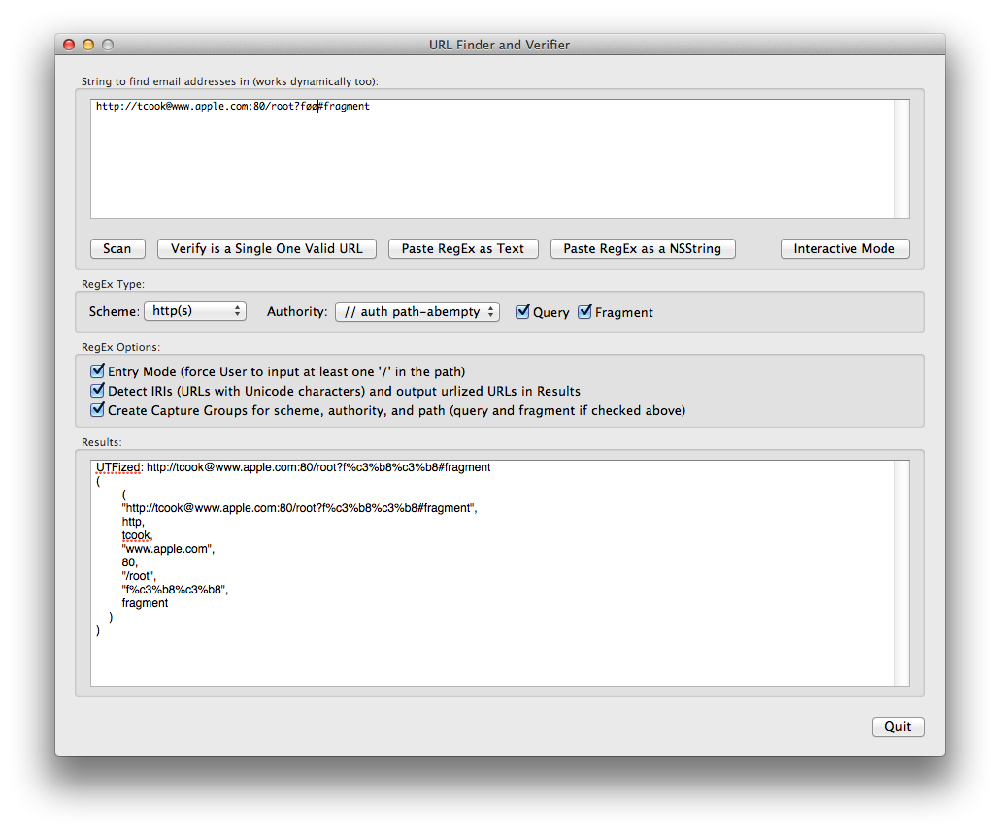

URLFinderAndVerifier
====================
Copyright (c) 2013 David Hoerl, all rights reserved. (see URLSearcher files for usage license)

When searching on the web, the curious developer finds a slew of regular expressions claiming to properly process URLs. However, it's virtually impossible to test their compliance as the specification is quite rich, and there is no official list of URLs to test against. That said, a site managed by Mathias Bynens (link below) contains a reasonably long list of URLs to use in a Unit Test.

This project uses is a set of regular expressions based solely on the specification, as shown on Jeff Roberson's web page, slighly modified to allows for the options below [see URL links below]. Jeff tracks each portion of the spec as he builds up his expressions, and you can verify his work at each step. Thus, this is no "Look at my nifty impossible to understand regular expression, just trust that it works", but something based exactly on the requisite RFC [link also below].

Jeff Roberson's regular expressions are commented, and thus they were brought over "as is", some modifications made to support the options below. Each part is contained in a file, so no escaping was required - making them much easier to read. A file processor removes comments, spaces, etc to facilitate reading and understanding what each does, and to allow easier comparison to his originals.

Given this near-perfect regular expression, how can we use it? First, you can validate URLs as they are entered by a human for the purpose of enabling an "OK" button, and second, you can retrieve URLs contained within a text blob.

Thus, this project has three primary components: a regular expression builder with lots of options, a class that you use to validate and/or extract URLs, and a test harness that lets you expermiment with the various regulare expression creation options. When you find the options you want, you can paste the "raw" regular expression into a text file.

URL detectors have the following options:

- require a human to enter at least one '/' for the path, making it easier to set an "OK" button during dynamic entry (otherwise the button will go on when the first character of the authority is entered). Also requires at least one character after the query and/or fragment)

- allow users to enter Unicode characters as they enter a URL, then convert it to the proper encoding (has the same match semantics as regular ASCII would), i.e. http://www.example.com/düsseldorf?neighbourhood=Lörick

- use capture groups so the various components of the URL will be returned (scheme, userinfo, host, port, path, and optionally query or fragment)

- look for just http/https/ftp schemes, or any scheme.

- accept or reject URLs with queries and/or fragments [frankly you would probably want them both on, but they are provided for completeness]

With the regular expression you can then either verify a single string, retrieve an array of URLs found in an arbitrary text string, or dynamically test the input string as you type.

Many developers though do not want to process text to the full standard; like me, they are looking to extract (or validate) http and https requests. So this project supports arbitrary regular expression construction, but using various component expressions and gluing them together.

Jeff Roberson's Regular Expressions: http://jmrware.com/articles/2009/uri_regexp/URI_regex.html
RFC Reference: http://tools.ietf.org/html/rfc3986
ABNF Reference: http://en.wikipedia.org/wiki/Augmented_Backus–Naur_Form
Test URLS From: http://mathiasbynens.be/demo/url-regex

RFC-3986 Section 3.3
   The generic URI syntax consists of a hierarchical sequence of
   components referred to as the scheme, authority, path, query, and
   fragment.

      URI         = scheme ":" hier-part [ "?" query ] [ "#" fragment ]

      hier-part   = "//" authority path-abempty
								 / path-absolute
								 / path-rootless
								 / path-empty

   [ED: note that the alternatives are all "path..." items, authority is always required
        but can be a zero length string.]

   The scheme and path components are required, though the path may be
   empty (no characters).  When authority is present, the path must
   either be empty or begin with a slash ("/") character.  When
   authority is not present, the path cannot begin with two slash
   characters ("//").  These restrictions result in five different ABNF
   rules for a path (Section 3.3), only one of which will match any
   given URI reference.

   The following are two example URIs and their component parts:

         foo://example.com:8042/over/there?name=ferret#nose
         \_/   \______________/\_________/ \_________/ \__/
          |           |            |            |        |
       scheme     authority       path        query   fragment
          |   _____________________|__
         / \ /                        \
         urn:example:animal:ferret:nose
